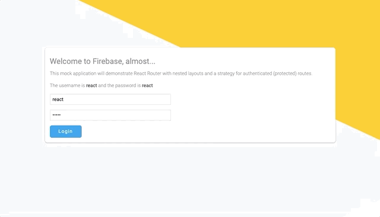

# React Router 5 Course Material

This course is not yet published (expected around May/June 2019) at https://courses.reacttraining.com/. Signup for our [Newsletter](https://reacttraining.com/newsletter/) if you want to be notified when the course is available.

In the mean time, feel free to explore this early version of the course material repo to see how I'm using React Router 5 to nest layouts in this Firebase-like design. If you see anything weird or broken just open an issue so I can fix it

If you're wondering what's new in React Router 5? Not a lot except internal optimizations and fixes for React 16.x. So you could also think of this as a React Router 4 course since the API is the same. [See more info on the React Router 5 release](https://reacttraining.com/blog/react-router-v5/)

This is not the real Firebase, this is what we're making:



## Install

```bash
npm install
npm start
```

## Fake Database

Just so we can mimic some data and pretend it's asynchronous, there's a `src/database.json`. Feel free to add more "Firebase Projects" if you want.

## The CSS

I used `className`. Who cares, it keeps the styling clutter out of the JS files since this is teaching material for routing.

## Code Organization

In `/src` you'll see:

- `layouts` for highly re-usable app-wide layouts
- `styles` for Sass modules
- `ui` is where I like to put re-usable "leaf-types" of components
- `utils` is a catch all for React components that are more utilitarian in nature (and less UI in nature) and other general utils.

Any other folder in `/src` is a section of the site, like `/auth` and `/projects` which coorespond to `localhost:8000/auth` etc. I guess I could organize those into a `/pages` folder, but who likes deep nesting anyways?
